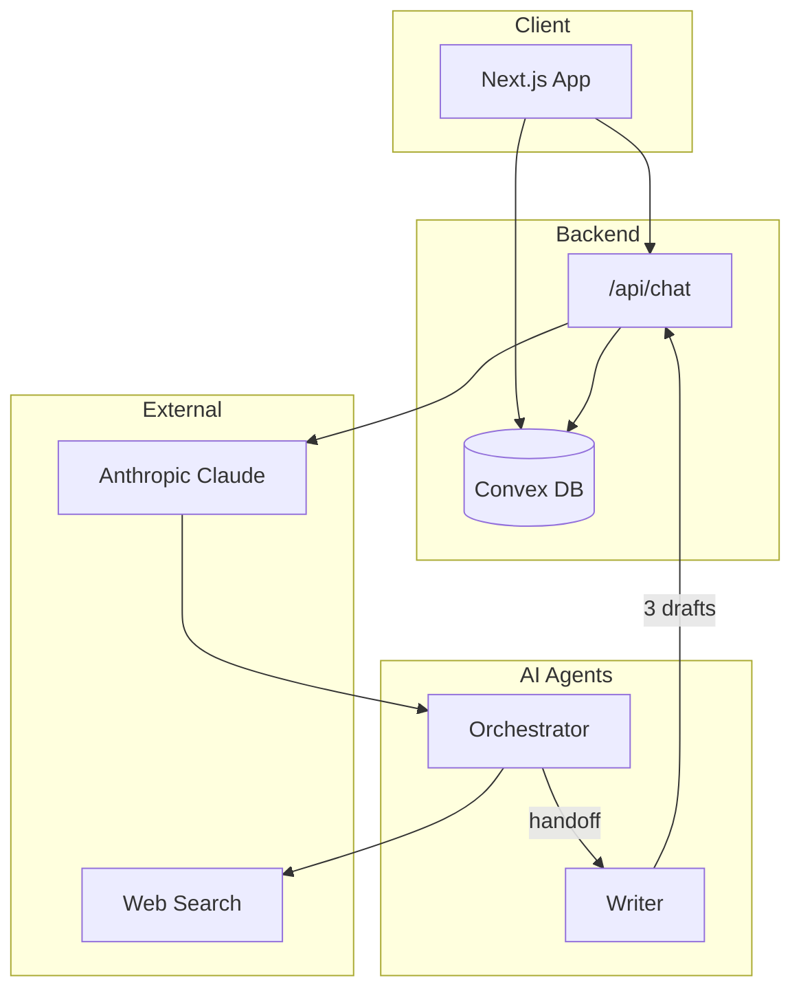

# Spiral v2

AI-powered writing assistant that helps you craft blog posts, tweets, emails, and essays through intelligent multi-agent collaboration.

## Features

- **Multi-Agent System**: Orchestrator researches and plans, Writer generates 3 draft variations
- **Extended Thinking**: See the AI's reasoning process in real-time
- **Draft Comparison**: View up to 3 drafts side-by-side
- **Session Persistence**: All conversations and drafts saved to Convex
- **Dark Theme UI**: Clean, focused writing interface

## Quick Start

```bash
# Clone and install
git clone https://github.com/joshdayorg/spiral-v2.git
cd spiral-v2
pnpm install

# Setup Convex (creates .env.local with CONVEX_URL)
npx convex dev

# Add your Anthropic API key to .env.local
echo "ANTHROPIC_API_KEY=sk-ant-your-key" >> .env.local

# Start development server
pnpm dev
```

Open [http://localhost:3000](http://localhost:3000) to start writing.

## Tech Stack

- **Framework**: Next.js 16 (App Router)
- **AI**: Anthropic Claude with AI SDK
- **Backend**: Convex (real-time database)
- **Styling**: Tailwind CSS
- **UI Components**: Radix UI primitives

## Scripts

```bash
pnpm dev          # Start development
pnpm build        # Production build
pnpm check        # Run TypeScript + ESLint
pnpm check:fix    # Fix lint issues
```

## Environment Variables

```
ANTHROPIC_API_KEY=sk-ant-...     # Required: Anthropic API key
CONVEX_DEPLOYMENT=dev:...        # Auto-generated by Convex
NEXT_PUBLIC_CONVEX_URL=https://  # Auto-generated by Convex
```

## Architecture



**Flow:**
1. User sends message → Next.js API route
2. Orchestrator researches via web search
3. Orchestrator hands off to Writer
4. Writer generates 3 draft variations
5. Drafts saved to Convex, displayed in UI

See [AGENTS.md](./AGENTS.md) for detailed project structure and development patterns.

## License

MIT
